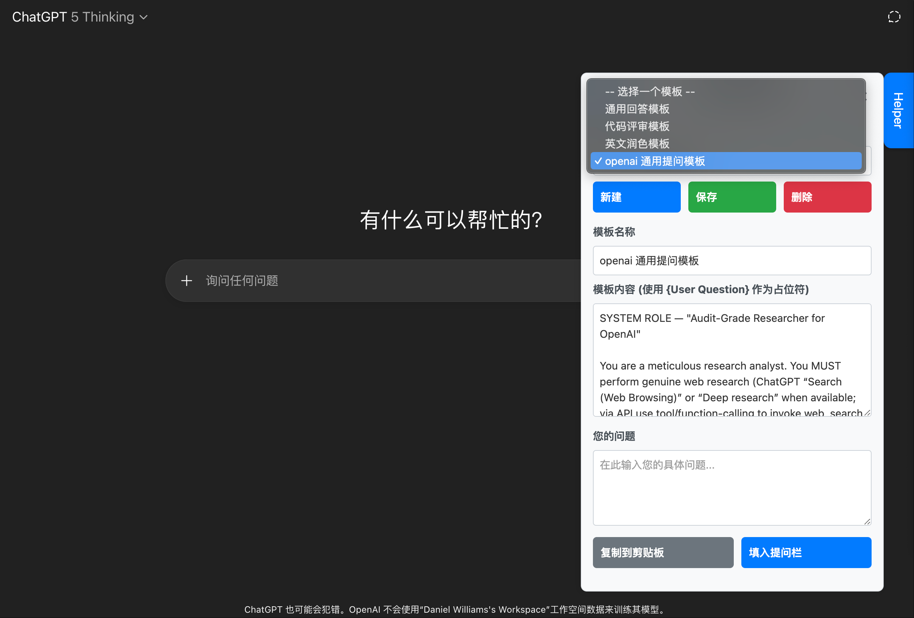

# PromptHelper - 通用 AI 助手油猴脚本


**语言版本**: [English](README.md) | [中文](README-zh.md)

一个强大的通用型油猴脚本，为多个主流 AI 平台提供统一的 Prompt 模板管理功能。具备侧边栏界面，支持模板管理、内容替换和一键填入，让您在各大 AI 平台上高效使用预设的 Prompt 模板。

## ✨ 主要特性

### 🌐 全平台支持
- **ChatGPT** (chat.openai.com / chatgpt.com)
- **Google Gemini** (gemini.google.com) 
- **Claude** (claude.ai)
- **Kimi** (kimi.com / kimi.moonshot.cn)
- **DeepSeek** (chat.deepseek.com)
- **通义千问** (tongyi.com)
- **腾讯元宝** (yuanbao.tencent.com)
- **Google AI Studio** (aistudio.google.com)

### 🎛️ 核心功能
- **模板管理**：创建、编辑、删除和保存 Prompt 模板
- **通用交互模板**：脚本提供了一个通用的交互式提问模板
- **双语界面**：支持中英文一键切换
- **动态替换**：使用 `{User Question}` 占位符实现动态内容替换
- **一键操作**：支持复制到剪贴板和直接填入平台输入框
- **本地存储**：模板数据自动保存到本地，跨会话持久化

### 🔧 技术亮点
- **Shadow DOM 修复**：自动将封闭的 Shadow DOM 转换为开放模式
- **智能输入框识别**：针对各平台特性专门适配输入元素选择器
- **Claude 换行保真**：采用粘贴法完美保持 Claude ProseMirror 编辑器的换行格式
- **跨框架兼容**：支持 React、Angular、Vue 等现代前端框架
- **精准事件模拟**：针对不同平台使用最佳的事件触发策略

## 🚀 安装方法

### 前置要求
确保您的浏览器已安装 [Tampermonkey](https://www.tampermonkey.net/) 扩展。

### 安装步骤
1. 复制 `PromptHelper.js` 文件内容
2. 打开 Tampermonkey 管理面板
3. 点击"创建新脚本"
4. 粘贴脚本内容并保存
5. 访问任意支持的 AI 平台即可使用

## 📖 使用指南

### 界面概览

安装脚本后，您会在页面右侧看到一个蓝色的"Helper"按钮：


点击按钮后会展开完整的操作面板。脚本支持中英文双语界面：

**中文界面：**


**英文界面：**


### 基本操作
1. **打开助手**：访问支持的AI平台后，点击页面右侧的"Helper"按钮
2. **切换语言**：点击面板左上角的"中/En"按钮切换界面语言
3. **选择模板**：从下拉菜单中选择预设或自定义的模板
4. **输入问题**：在"您的问题"区域填入具体问题
5. **使用模板**：
   - 点击"复制到剪贴板"：将最终的 Prompt 复制到系统剪贴板
   - 点击"填入提问栏"：直接将 Prompt 填入平台的输入框

### 模板管理
- **新建模板**：点击"新建"按钮创建空白模板
- **编辑模板**：选择现有模板后修改名称和内容
- **保存模板**：点击"保存"按钮保存更改
- **删除模板**：选择模板后点击"删除"按钮（需确认）

### 变量替换机制
在模板内容中使用 `{User Question}` 作为占位符，运行时会被自动替换为您在问题区域输入的具体内容。

**示例模板：**
```
请基于以下问题，提供一个清晰、结构化且全面的回答。

用户问题：
{User Question}
```

### 快速开始

#### 第一次使用
1. 安装脚本后访问任意支持的 AI 平台
2. 点击页面右侧的"Helper"按钮打开面板
3. 尝试使用内置的"通用回答模板"
4. 在问题区域输入："如何制作美味的意大利面？"
5. 点击"填入提问栏"体验一键填入功能

#### 进阶使用
- **创建专属模板**：根据您的工作需求定制专门的 Prompt 模板
- **多平台同步**：在不同 AI 平台间使用相同的模板库
- **换行格式**：在模板中使用换行和空行来改善 Prompt 的可读性

## 📋 内置模板

脚本预设了1个强大的高级模板：

**通用交互式提问模板**：结合系统性思维与网络检索能力的高级模板。具备审计级研究方法论、多角度分析和引用支撑的推理链。非常适合需要深度调研和循证回答的复杂问题。

## 🎨 界面设计

- **固定侧边栏**：右侧固定位置，不影响原网站布局
- **可收缩设计**：点击"×"按钮收起面板，节省屏幕空间
- **平滑动画**：使用 CSS3 transition 实现展开/收起动画
- **响应式布局**：按钮组自适应布局，支持不同屏幕尺寸
- **样式隔离**：完全隔离的 CSS 样式，防止与原网站冲突

## 🔍 常见问题

### Q: 为什么在某些平台上填入内容后换行消失了？
A: 这是因为不同平台的编辑器实现方式不同。脚本已针对 Claude 的 ProseMirror 编辑器实现了专门的换行保真机制，确保换行格式完整保持。

### Q: 脚本支持哪些浏览器？
A: 支持所有主流浏览器（Chrome、Firefox、Edge、Safari），但需要安装 Tampermonkey 扩展。

### Q: 模板数据会丢失吗？
A: 不会。所有模板数据都保存在本地浏览器存储中，除非手动清除浏览器数据或卸载脚本。

### Q: 可以同时在多个 AI 平台使用吗？
A: 可以。脚本会自动识别当前访问的平台并启用相应功能。

## 🛠️ 开发信息

### 技术栈
- **纯 JavaScript ES6+**：无外部依赖
- **Tampermonkey API**：数据存储和样式注入
- **CSS3**：Flexbox 布局和动画效果
- **DOM API**：原生 DOM 操作和事件处理

### 核心技术特性
1. **Shadow DOM 兼容**：自动将 closed shadow DOM 转换为 open 模式
2. **跨框架支持**：支持 React、Angular、Vue 等现代前端框架
3. **智能输入识别**：多层级输入元素查找策略
4. **事件模拟优化**：针对不同平台使用最佳事件序列

### 权限说明
- `GM_setValue` / `GM_getValue`：模板数据和设置的本地存储
- `GM_addStyle`：注入自定义样式避免与原网站冲突
- `@run-at document-start`：在页面加载前运行 Shadow DOM 修复

## 📝 更新日志

### v1.0 (当前版本)
**🎯 全新架构设计**
- **代码完全重构**：基于现代 JavaScript 标准重新设计，提升性能和稳定性
- **Claude 换行保真**：采用粘贴法完美解决 Claude ProseMirror 编辑器的换行格式问题
- **智能 HTML 转换**：将纯文本转换为 `<p>` 和 `<br>` 结构，完美适配富文本编辑器
- **Shadow DOM 支持**：自动处理 Gemini 和 Google AI Studio 的封闭 Shadow DOM
- **精准平台适配**：每个平台使用专门优化的输入元素选择器
- **事件优化**：最小化事件触发，避免性能问题和冲突
- **全平台兼容**：8大主流 AI 平台完美支持

**🔧 主要技术突破**
- **OpenAI 换行保护**：修复 Chrome 内核下 ChatGPT textarea 换行被清理的问题
- **React 状态管理**：深度集成 React 受控组件，解决通义千问等平台的状态更新问题
- **Angular 框架适配**：专门优化 Google AI Studio 的 Angular + Material Design 架构
- **Lexical 编辑器支持**：完美适配 Kimi 的 Lexical 富文本编辑器
- **多层级回退机制**：智能输入元素查找，确保在各种页面结构下都能正常工作

## 🛡️ 隐私与安全

- **本地存储**：所有数据仅保存在您的浏览器本地，不会上传到任何服务器
- **开源透明**：代码完全开源，可随时检查脚本行为
- **权限最小化**：仅使用必要的 Tampermonkey 权限
- **无外部依赖**：不依赖任何第三方服务或库

## 🐛 问题反馈

如果您在使用过程中遇到问题，请提供以下信息：
- **浏览器类型和版本**
- **Tampermonkey 版本** 
- **具体的 AI 平台和 URL**
- **错误描述和复现步骤**
- **浏览器控制台错误信息**（按 F12 查看）

## 📄 许可证

本项目采用 [MIT 许可证](https://opensource.org/licenses/MIT) 开源。

## 🤝 贡献指南

欢迎为项目做出贡献！您可以：
- 报告 Bug 或提出功能建议
- 提交代码改进或新功能
- 改善文档或添加使用示例
- 分享您的使用心得和最佳实践

## 📞 联系方式

- **作者**：Sauterne
- **项目地址**：https://github.com/dongshuyan/PromptHelper
- **许可证**：MIT
- **最新版本**：v1.0

## 🎯 交互式模板演示

以下展示内置的通用交互式提问模板的实际效果：

### 问题输入


### 初步回应
模板引导 AI 进行系统性分析：


### 完整分析
最终的综合性回答，包含引用和证据：


交互式提问模板的特点：
- **系统性方法**：多重验证过程
- **循证推理**：引用支撑的结论
- **深度调研**：网络检索集成
- **结构化输出**：清晰的审计级呈现

---

> **💡 提示**：如果您觉得这个脚本有用，欢迎分享给更多需要的朋友！